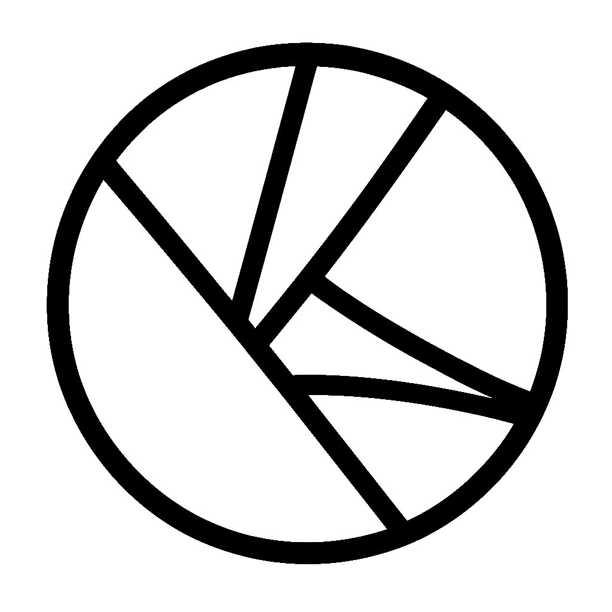

  <picture>
    <source srcset="./assets/oac-inverted-transparent.png" media="(prefers-color-scheme: dark)">
    
  </picture>

> Ordered Atomic Collaboration (OAC) is a paradigm for decentralized consequence.

<h1>
  oac
  <picture>
    <source srcset="./assets/oac-inverted-transparent.png" media="(prefers-color-scheme: dark)">
    
  </picture>
</h1>

We recommend those new to the paradigm review the latest [OGUIDE](./oguide/oera-000-000-000-dulan/oguide-000-000-000/README.md). 

OAC is intended to be conceptually oriented and implementation agnostic. Before contributing to this repository, consider whether your intents are implementation specific by reviewing the following: 

OAC also refers to the organization that manages this repository. 

> [!NOTE]
> **OAC** is not a legally represented organization. While the contents of this repository describe internal governance and can be treated like bylaws, they are not binding in any legal jurisdiction. 
>
> The **OAC** repository is licensed under the [MIT License](./LICENSE) and can be used at will.

Currently, OAC is governed by [Ramate LLC](ramate.io). Likewise all implementations of OAC protocols are found under Ramate LLC's [`robles`](https://github.com/ramate-io/robles) project.

## Organization 
- [`oera`](./oera): OAC Eras (OERA) are the periods over which a governing body makes decisions. All other OAC Artifacts are indexed by OERA. 
- [`ogloss`](./ogloss/): OAC Glosses (OGLOSS) are defined terms for OAC. 
- [`oproc`](./opurp/): OAC Proclamations (OPROC) are statements of purpose for OAC. 
- [`ogov`](./ogov/): OAC Governance (OGOV) are constitutions of, procedures for, and interpretations of OAC governance. 
- [`oleg`](./oleg/): OAC Legal Documents (OLEG) are published legal documents covering OAC operations in any jurisdiction. 
- [`ocert`](./ocert/): OAC Certificates (OCERT) certify a given project as abiding by the OAC paradigm. 
- [`odes`](./odes/): OAC Desiderata (ODES) describe wants, open problems, and similar within the OAC paradigm. 
- [`ores`](./ores): OAC Resolutions (ORES) describe resolutions to ODES. Generally, contributors should use ORES to justify non-trivial changes to this repository. 
- [`oart`](./oart/): OAC Articles (OART) are academic papers which form the conceptual backbone of the OAC paradigm. 
- [`oroad`](./oroad/): OAC Roadmaps (OROAD) are roadmaps describing the intents and objectives of the OAC organization. 
- [`olog`](./olog/): OAC Logs (OLOG) are periodically submitted logs describing various developments within the OAC paradigm. 
- [`oguide`](./oguide/): OAC Guides (OGUIDE) are guides or summaries of OAC.